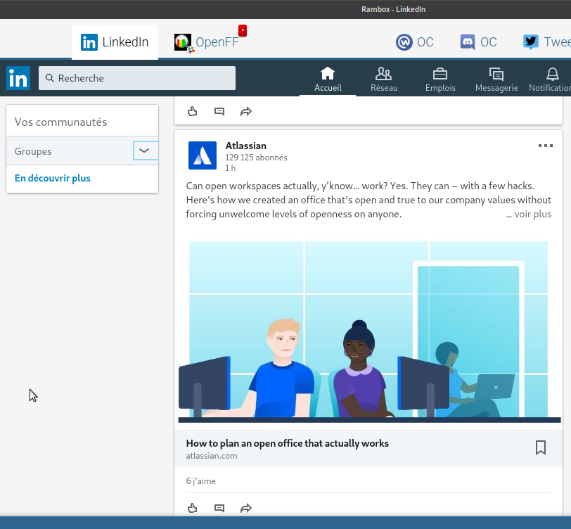

# [PyDev] Projet 12

_Construisez une veille technologique_

---

Un développeur doit rester constamment à l'affût des nouveautés technologiques, qui évoluent en continu. La veille technologique est pour cela une étape indispensable. Les bons développeurs suivent régulièrement les nouveautés du secteur.

Pour rester à jour, j'ai tout d'abord choisi mes sujets, puis j'ai mis en place une veille en 2 parties : en ligne et hors-ligne

---

## Objectifs[&darr;](#en-ligne)

Les technologies qui à ce jours font l'objet de mon attention quotidienne font partie, _en gros_, des éco-systèmes _Python_ & de l'_admin-sys linux_.

Mon profil [Stack Overflow][so] reflète d'ailleurs ces centres d'intérêts :

* debian
* django
* flask
* linux
* mariadb
* postgresql
* python
* shell

---

## En ligne[&darr;](#stackoverflowcom)

L'Internet, est un outil indispensable et primordial pour se tenir informer. À ce titre voici les services que j'utilise au quotidien.

##### `stackoverflow.com`[&darr;](#developpezcom)

Imbattable pour compenser une documentation incomplète ou incomprise, c'est un endroit idéal pour savoir quelles sont les os que rongent les acteurs de l'IT :

##### `developpez.com`[&darr;](#githubcom)

Le portail francophone de référence du développement informatique et des pro de l'IT, une communauté active et pertinente :

##### `github.com`[&darr;](#linkedincom)

Ce service est surtout connu pour héberger du code et faciliter sa production en équipe. Mais certaines de ses fonctionnalités sont intéressante dans une veille, comme les tendances par exemple :

* [developpeurs _tendance_ en python](github-trending-dev-py.jpg)
* [dépôts _tendance_ en python](github-trending-repo-py.jpg)
* [dépôts _tendance_ en shell](github-trending-repo-shell.jpg)

Mais pour un développeur il est aussi important de s'intéresser au _vieillissement_ de son code, et sur ce sujet _github_ propose une _alerte vulnérabilité_ des dépendances du code tout à fait pratique :

D'abord un peu de configuration :

… et le tour est joué, vous voilà au courant des librairies à mettre à jour dans vos projets :

##### `linkedin.com`[&darr;](#twittercom)

Outil de mise en relation et d'information professionnel, il n'est pas spécialiste de la veille techno, cependant les acteurs du milieu y sont et une fois pris en compte le fait que c'est d'abord de la com' on à une source d'information orienté _business_ qui n'est pas dénuée d'intérêt :

##### `twitter.com`[&darr;](#webinaires)

Au cœur du réacteur! C'est **la** place numérique de l'actualité en directe. Attention au temps passé : le débit permanent de nouveauté peu dilapider les heures de travail d'une journée sans un minimum de discipline.

Hormis se tenir informer, on peut également prendre contact très facilement avec les utilisateurs, ainsi j'ai pu transmettre une remontée d'anomalie aux responsables du site www.markdowntopdf.com

Enfin pour y voir plus clair entre les tweets, la création de liste permet de regrouper les publications. De plus j'utilise l'outil _TweetDeck_ permettant de suivre plusieurs flux agencés en colonne. Indispensable quand on utilise _twitter_ avec différant thèmes.

##### Webinaires[&darr;](#hors-ligne)

Enfin, pour clôturer cette partie sur les outils numériques, une tendance actuelle prends de l'ampleur : _les webinaires_. On trouve cette [définition sur wikipedia][wikiwebinaire] :

> Webinaire est un mot-valise associant les mots web et séminaire, créé pour désigner toutes les formes de réunions interactives de type séminaire faites via Internet généralement dans un but de travail collaboratif ou d'enseignement à distance.

Y participer est un excellent moyen de découvrir/apprendre une technologie ou un outil d'actualité pour lesquels les spécialistes sont peut présent autour de chez soit.

---

## Hors ligne[&darr;](#une-communaute-de-travail)

Lire de la doc, des news, visionner des vidéos ou participer à des _webinaires_ c'est bien; mais pour moi ce n'est pas suffisant. Le contact humain est aussi un moyen précieux de se tenir au courant. Voici 2 manières de prendre contact et entretenir un réseau professionnel _AFK_.

##### Une communaute de travail[&darr;](#meetupcom)

Le concept de _co-working_ est à la mode et mis à toute les sauces… Dans cette jungle, j'ai choisi de fréquenter chaque semaine une communauté Lyonnaise (mais pas que) : [La Cordée][cordee]. On y croise 33% de télé-travailleurs, 33% d'indépendant et 33% de _gens bizarre_.

En plus de proposer un cadre de travail (table, chaise, intenet, imprimante, cuisine, douches, WC, etc.) on y rencontre des professionnels de l'IT mais aussi des gens que l'on aurait _jamais_ croisé dans une entreprise _classique_ (traducteur, _youtubeur_, psychologue, arbitre internationnal de ping-pong, etc.)

Ça tombe bien, c'est justement dans cette communauté de travail où sont organisés les _co-working_ étudiants d'_OpenClassrooms_, un super outil pour échanger entre étudiants d'horizons différant et aux expériences et compétences riches :

##### `meetup.com`[&darr;](#conclusion)

Ce service propose de faciliter l'organisation de conférences en facilitant la mise en relation de celles et ceux qui ont des choses à présenter et celles et ceux qui pourraient être intéressé.

J'ai pris le temps cette année de fréquenter les rendez-vous mensuels de la communauté _Python_ de Lyon.

Mais aussi un meetup _non-Python_

Enfin, pour boucler la boucle et pour faire de nouvelles expériences, j'ai pris l'engagement de présenter ma 1ère conférence pour la communauté Python ce mois de janvier 2019 :

---

## Conclusion

La veille est une partie importante quand on pratique une activité professionnelle, le développement informatique n'y échappe pas et fait partit de ces activités qui nécessitent un investissement temporel important pour rester en phase avec le monde.

Attention cependant à ne pas se faire cannibaliser par ces outils avec lesquels il peut-être parfois difficile de prendre conscience du temps qui passe.

[so]: https://stackoverflow.com/users/6709630/freezed
[cordee]: https://www.la-cordee.net/
[wikiwebinaire]: https://fr.wikipedia.org/wiki/Webinaire
[meetupall]: meetup-py-all.png
